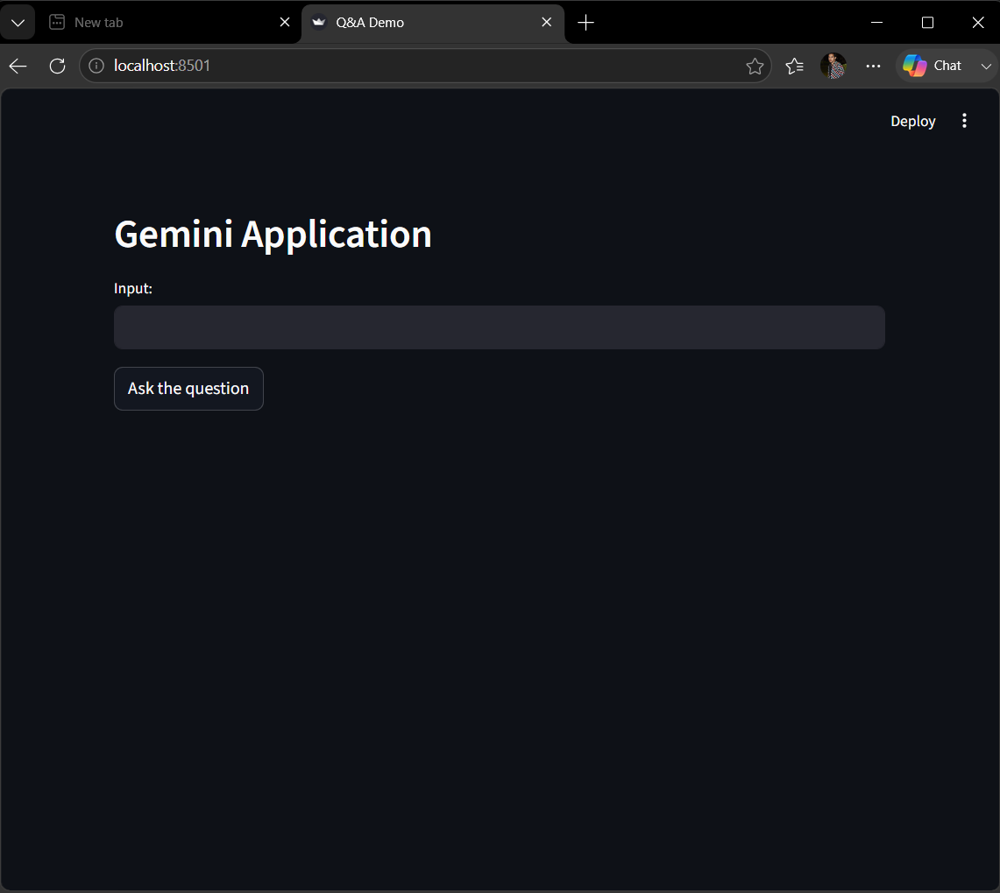
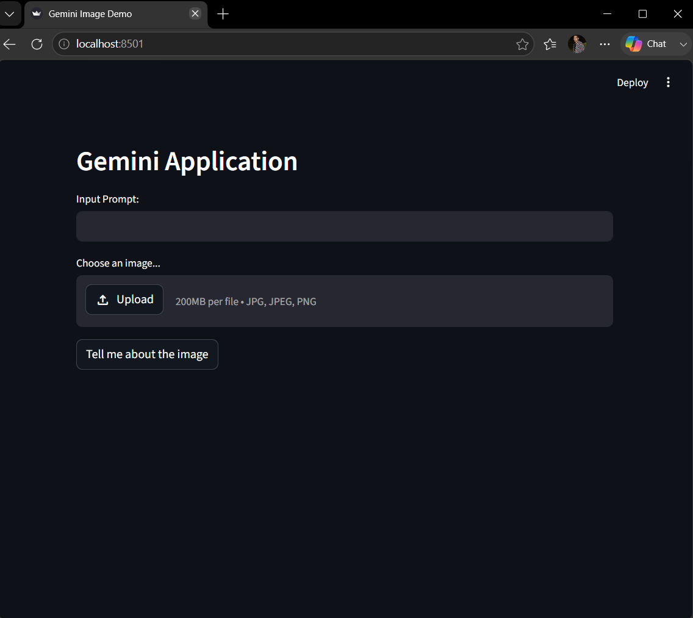
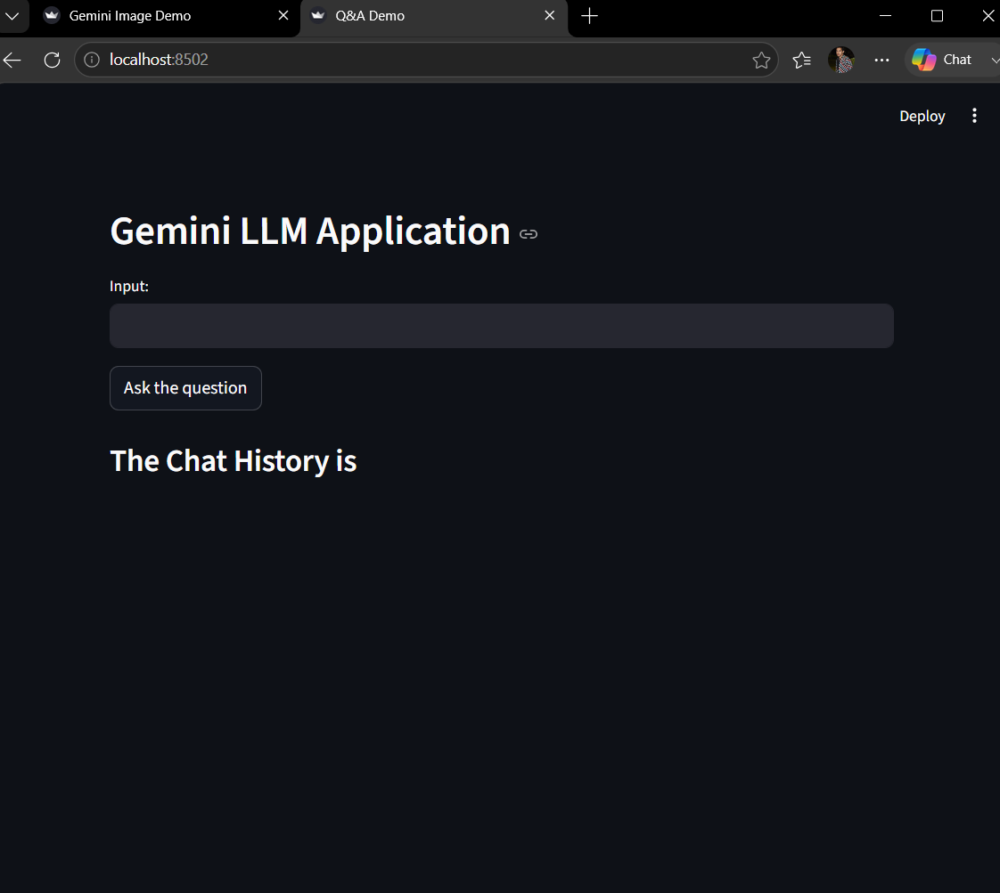

# 🚀 End-To-End Gemini Project

A collection of AI applications built using **Google Gemini API**, **Python**, and **Streamlit**. This repository demonstrates how to build conversational AI, image understanding, and question-answering applications powered by Google's Gemini models.

---

## 📂 Project Structure

```
End-To-End-Gemini-Project/
│
├── screenshots
│   ├── chatbot.png
│   ├── vision.png
│   └── qachat.png
│
├── app.py                  # Main Streamlit application
├── chat.py                 # Gemini Chatbot
├── qachat.py               # Question Answering Chatbot
├── vision.py               # Gemini Vision (Image Analysis)
├── requirements.txt
└── README.md
```

---

## ✨ Features

### 🤖 Gemini Chatbot
- Interactive AI chatbot
- Real-time conversations
- Powered by Gemini Flash Model

### ❓ Question Answering
- Ask any question
- Instant AI-generated answers
- Natural language understanding

### 🖼️ Gemini Vision
- Upload images
- Describe images
- Answer questions about images
- Image understanding using Gemini Vision

### ⚡ Streamlit Interface
- Simple UI
- Fast responses
- Easy deployment

---

## 🛠️ Technologies Used

- Python
- Google Gemini API
- Streamlit
- Pillow (PIL)
- python-dotenv
- Google Generative AI SDK

---

## 📦 Installation

### Clone Repository

```bash
git clone https://github.com/manasranjanmeher99/Gemini-Project/new/main/End-To-End-Gemini-Project.git
```

Move into the project

```bash
cd End-To-End-Gemini-Project
```

Install dependencies

```bash
pip install -r requirements.txt
```

---

## 🔑 API Key Setup

Create a `.env` file in the project directory.

```env
GOOGLE_API_KEY=YOUR_API_KEY
```

---

## ▶️ Run the Project

For Chatbot

```bash
streamlit run chat.py
```

For Vision App

```bash
streamlit run vision.py
```

For Question Answering

```bash
streamlit run qachat.py
```

For Main App

```bash
streamlit run app.py
```

---

## 📷 Screenshots

### Gemini Chatbot



---

### Gemini Vision


---

### Question Answering



---

## 📌 Requirements

```
streamlit
google-generativeai
python-dotenv
Pillow
```

Or install using

```bash
pip install -r requirements.txt
```

---

## 💡 Future Improvements

- Chat History
- Dark/Light Theme
- Voice Assistant
- PDF Question Answering
- Image Editing
- Document Understanding
- OCR
- Speech-to-Text
- Text-to-Speech
- Multi-language Support

---

## 🎯 Learning Outcomes

This project demonstrates:

- Google Gemini API Integration
- Prompt Engineering
- Streamlit Development
- Image Processing
- AI Chatbots
- Vision AI
- Environment Variables
- Python Project Structure

---

## 🤝 Contributing

Contributions are welcome!

1. Fork the repository
2. Create a feature branch

```bash
git checkout -b feature-name
```

3. Commit your changes

```bash
git commit -m "Added new feature"
```

4. Push to GitHub

```bash
git push origin feature-name
```

5. Create a Pull Request

---

## 📜 License

This project is licensed under the MIT License.

---

## 👨‍💻 Author

**Manas Ranjan Meher**

- Aspiring AI & Data Science Engineer
- Passionate about Generative AI, Machine Learning, and Python

---

⭐ If you found this project helpful, don't forget to star the repository!
