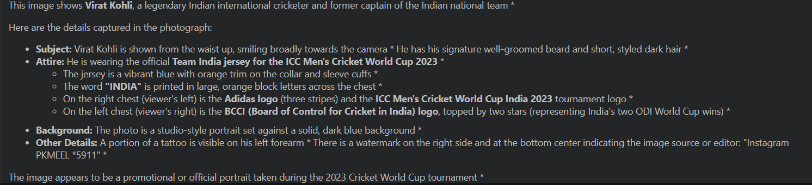

# 🤖 Gemini AI with Python

A beginner-friendly project demonstrating how to use **Google Gemini AI** in Python. This notebook covers the fundamentals of the Gemini API, including text generation, multimodal image understanding, model exploration, and chat interactions using the Google Generative AI SDK.

---

## 📸 Project Preview

<p align="center">
  
</p>

---

# 📂 Project Structure

```
gemini-ai-introduction/
│
├── gemini_intro.ipynb              # Main Jupyter Notebook
├── requirements.txt                # Python dependencies
├── README.md                       # Project documentation
│
├── input/
│   └── virat1.jpg                  # Sample image used for multimodal AI
│
└── screenshots/
    └── Text_generate_output.png    # Output screenshot
```

---

# 🚀 Features

✅ Configure Gemini API

✅ Generate text using Gemini

✅ Explore available Gemini models

✅ Compare different Gemini models

- Gemini 3 Flash Preview
- Gemini 3.1 Flash Lite
- Gemini 3.6 Flash

✅ Measure response generation time

✅ Image-to-Text Generation (Multimodal AI)

✅ Start an AI Chat Session

---

# 🛠 Technologies Used

- Python
- Google Gemini API
- Google Generative AI SDK
- Jupyter Notebook
- IPython
- Pillow (PIL)

---

# 📦 Installation

Clone the repository

```bash
git clone https://github.com/manasranjanmeher99/Gemini-Project/new/main/gemini-ai-introduction.git
```

Move into the project directory

```bash
cd gemini-ai-introduction
```

Install the required packages

```bash
pip install -r requirements.txt
```

---

# 🔑 Configure API Key

Generate a Gemini API Key from **Google AI Studio**.

Set the API key before running the notebook.

```python
import os

os.environ["GEMINI_API_KEY"] = "YOUR_API_KEY"
```

---

# 📖 Notebook Contents

## 1. Installing the Gemini SDK

Install the Google Generative AI package.

---

## 2. Configure API

Authenticate using your Gemini API Key.

---

## 3. Initialize Gemini Model

Create a Gemini model instance.

```python
model = genai.GenerativeModel("models/gemini-3-flash-preview")
```

---

## 4. Text Generation

Generate AI responses from prompts.

Example prompt:

> Difference between AI vs ML vs GenAI vs LLM vs Agentic AI

---

## 5. Display Markdown Output

Convert generated text into properly formatted Markdown for better readability.

---

## 6. Explore Available Models

List all Gemini models that support text generation.

```python
genai.list_models()
```

---

## 7. Compare Gemini Models

The notebook demonstrates responses from multiple Gemini models.

- Gemini 3 Flash Preview
- Gemini 3.1 Flash Lite
- Gemini 3.6 Flash

---

## 8. Measure Response Time

Uses Jupyter's

```python
%%time
```

to compare inference speed.

---

## 9. Multimodal AI (Image Understanding)

The notebook demonstrates image analysis by providing an image directly to Gemini.

Example:

```python
response = model.generate_content(img)
```

Sample input image:

<p align="center">
  
</p>

---

## 10. Chat with Gemini

Create an interactive chat session.

```python
chat = model.start_chat(history=[])
```

---

# 📸 Sample Output

The generated response is available in:


---

# 📋 Requirements

```
google-generativeai
python-dotenv
jupyter
ipython
pillow
```

Install them using

```bash
pip install -r requirements.txt
```

---

# 🎯 Learning Outcomes

After completing this notebook, you will understand:

- Gemini API authentication
- Prompt engineering basics
- Text generation
- Markdown formatting
- Model selection
- Response time benchmarking
- Multimodal AI
- Image understanding
- Chat-based AI interactions

---

# ⭐ Future Improvements

- Streamlit Chatbot
- PDF Question Answering
- Vision + Chat Application
- Image Caption Generator
- AI Assistant
- Function Calling
- RAG using Gemini

---

# 🤝 Contributing

Contributions are welcome.

1. Fork the repository
2. Create a feature branch
3. Commit your changes
4. Push your branch
5. Open a Pull Request

---


# 👨‍💻 Author

**Manas Ranjan Meher**
- Aspiring AI & GenAI Developer
- Python | Machine Learning | Generative AI

If you found this project helpful, don't forget to ⭐ star the repository.
